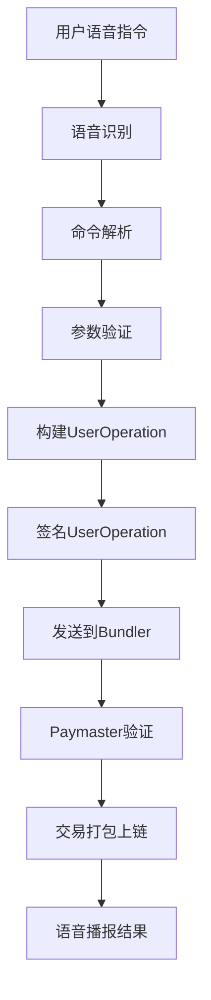

# Echo Wallet - 开发文档

## 📋 目录结构建议

基于 Next.js + ethers.js 的完整项目目录结构：

```
echo-wallet/
├── public/                         # 静态资源
│   ├── icons/                      # 图标文件
│   └── sounds/                     # 语音提示音
├── src/
│   ├── app/                        # Next.js App Router
│   │   ├── globals.css            # 全局样式
│   │   ├── layout.tsx             # 根布局
│   │   └── page.tsx               # 主页
│   ├── components/                 # React组件
│   │   ├── AccessibilityComponents.tsx  # 无障碍组件
│   │   ├── WalletInterface.tsx          # 主钱包界面
│   │   ├── TransactionHistory.tsx      # 交易历史
│   │   └── VoiceCommands.tsx           # 语音命令组件
│   ├── services/                   # 业务服务层
│   │   ├── voiceService.ts        # 语音识别和合成
│   │   ├── walletService.ts       # 钱包操作
│   │   ├── commandService.ts      # 语音命令处理
│   │   ├── aaWalletService.ts     # ERC-4337钱包服务
│   │   └── storageService.ts      # 本地存储服务
│   ├── store/                      # 状态管理
│   │   ├── index.ts               # Zustand store
│   │   ├── walletStore.ts         # 钱包状态
│   │   ├── voiceStore.ts          # 语音状态
│   │   └── transactionStore.ts    # 交易状态
│   ├── types/                      # TypeScript类型定义
│   │   ├── index.ts               # 主类型文件
│   │   ├── wallet.ts              # 钱包相关类型
│   │   ├── voice.ts               # 语音相关类型
│   │   └── transaction.ts         # 交易相关类型
│   ├── config/                     # 配置文件
│   │   ├── index.ts               # 主配置文件
│   │   ├── networks.ts            # 网络配置
│   │   ├── tokens.ts              # 代币配置
│   │   └── voice.ts               # 语音配置
│   ├── utils/                      # 工具函数
│   │   ├── crypto.ts              # 加密工具
│   │   ├── format.ts              # 格式化工具
│   │   ├── validation.ts          # 验证工具
│   │   └── accessibility.ts       # 无障碍工具
│   ├── hooks/                      # 自定义Hook
│   │   ├── useVoice.ts            # 语音相关Hook
│   │   ├── useWallet.ts           # 钱包相关Hook
│   │   └── useAccessibility.ts    # 无障碍Hook
│   └── constants/                  # 常量定义
│       ├── commands.ts            # 语音命令常量
│       ├── messages.ts            # 消息模板
│       └── errors.ts              # 错误信息
├── docs/                           # 文档
│   ├── architecture.md            # 架构文档
│   ├── api.md                     # API文档
│   ├── accessibility.md           # 无障碍指南
│   └── deployment.md              # 部署指南
├── tests/                          # 测试文件
│   ├── __mocks__/                 # Mock文件
│   ├── unit/                      # 单元测试
│   ├── integration/               # 集成测试
│   └── accessibility/             # 无障碍测试
├── .env.example                    # 环境变量示例
├── .env.local                      # 本地环境变量
├── package.json                    # 项目依赖
├── tsconfig.json                   # TypeScript配置
├── tailwind.config.js              # Tailwind配置
├── next.config.ts                  # Next.js配置
└── README.md                       # 项目说明
```

## 🚀 推荐的开发步骤

### 阶段1: 项目基础搭建 (第1-2天)

1. **初始化项目结构**
   ```bash
   npx create-next-app@latest echo-wallet --typescript --tailwind --app
   cd echo-wallet
   ```

2. **安装核心依赖**
   ```bash
   npm install ethers@5.7.2 zustand @radix-ui/react-button @radix-ui/react-dialog
   ```

3. **配置TypeScript和ESLint**
   - 严格模式TypeScript配置
   - 无障碍相关的ESLint规则

4. **创建基础组件结构**
   - 无障碍组件库
   - 基础布局组件
   - 语音交互组件

### 阶段2: 语音交互系统 (第3-4天)

1. **语音识别服务** (`voiceService.ts`)
   ```typescript
   // 实现Web Speech API集成
   // 语音命令解析逻辑
   // 语音合成功能
   // 错误处理和重试机制
   ```

2. **语音命令处理** (`commandService.ts`)
   ```typescript
   // 命令路由分发
   // 参数提取和验证
   // 上下文管理
   // 确认流程
   ```

3. **语音UI组件**
   - 语音按钮组件
   - 状态指示器
   - 语音反馈组件

### 阶段3: 钱包核心功能 (第5-6天)

1. **基础钱包服务** (`walletService.ts`)
   ```typescript
   // 钱包创建和导入
   // 余额查询
   // 基础转账功能
   // 交易状态查询
   ```

2. **状态管理** (`store/`)
   ```typescript
   // 钱包状态管理
   // 交易历史管理
   // 语音状态管理
   // 错误状态处理
   ```

3. **主要界面组件**
   - 钱包仪表板
   - 交易历史
   - 余额显示

### 阶段4: ERC-4337集成 (第7-8天)

1. **账户抽象服务** (`aaWalletService.ts`)
   ```typescript
   // ZeroDev SDK集成
   // UserOperation构建
   // Bundler客户端
   // Paymaster集成
   ```

2. **智能钱包功能**
   - 智能钱包创建
   - 批量操作
   - Gas代付逻辑
   - 合约交互

### 阶段5: 无障碍优化 (第9天)

1. **无障碍测试**
   - 屏幕阅读器测试
   - 键盘导航测试
   - 语音交互测试
   - WCAG合规性检查

2. **性能优化**
   - 语音识别延迟优化
   - 界面响应速度优化
   - 错误恢复机制

### 阶段6: 测试和部署 (第10天)

1. **综合测试**
   - 端到端测试
   - 用户体验测试
   - 安全性测试
   - 多浏览器兼容性

2. **部署准备**
   - 环境配置
   - 构建优化
   - 错误监控

## 🔧 重点实现细节

### 1. ZeroDev Bundler & Paymaster 集成流程

```typescript
// 1. 创建Kernel Account
const kernelAccount = await createKernelAccount({
  projectId: ZERODEV_PROJECT_ID,
  plugins: {
    sudo: ecdsaValidator
  }
})

// 2. 创建Account Client
const kernelClient = createKernelAccountClient({
  account: kernelAccount,
  chain: sepolia,
  bundlerTransport: http(BUNDLER_URL),
  middleware: {
    sponsorUserOperation: async ({ userOperation }) => {
      return paymasterClient.sponsorUserOperation({
        userOperation,
        entryPoint: ENTRYPOINT_ADDRESS_V07
      })
    }
  }
})

// 3. 发送UserOperation
const txHash = await kernelClient.sendTransaction({
  to: recipient,
  value: amount,
  data: '0x'
})
```

### 2. ERC-4337 UserOperation 发起流程



### 3. 无障碍设计考虑

**ARIA标签使用**:
```typescript
<button
  aria-label="开始语音输入，按空格键激活"
  aria-pressed={isListening}
  aria-live="polite"
  role="button"
>
  {isListening ? '正在听...' : '点击说话'}
</button>
```

**键盘导航支持**:
```typescript
const handleKeyDown = (event: KeyboardEvent) => {
  switch (event.key) {
    case ' ': // 空格键激活语音
      startVoiceRecognition()
      break
    case 'Escape': // ESC键停止
      stopVoiceRecognition()
      break
    case 'F1': // F1键帮助
      announceHelp()
      break
  }
}
```

**屏幕阅读器优化**:
```typescript
// 使用语义化HTML
<main role="main">
  <section aria-labelledby="wallet-title">
    <h2 id="wallet-title">钱包信息</h2>
    <div aria-live="polite" id="balance-info">
      余额: {balance} ETH
    </div>
  </section>
</main>
```

### 4. 语音流程的流畅性设计

**语音命令流程**:
```typescript
// 1. 激活监听
user: "创建钱包"

// 2. 系统确认
system: "正在创建新钱包，请稍候..."

// 3. 处理完成
system: "钱包创建成功，您的地址是 0x123...456"

// 4. 助记词播报
system: "请记住您的助记词，第1个词：abandon..."

// 5. 安全提醒
system: "请将助记词妥善保存，这是恢复钱包的唯一方式"
```

**错误处理流程**:
```typescript
// 语音识别失败
system: "抱歉，我没有听清您的指令，请重新说一遍"

// 网络连接失败
system: "网络连接失败，请检查网络后重试"

// 交易失败
system: "转账失败，原因是余额不足，请检查账户余额"
```

## 🔐 安全实践

1. **私钥安全**
   - 私钥仅在本地生成和存储
   - 使用Web Crypto API进行加密
   - 实现安全的内存清理

2. **输入验证**
   - 地址格式验证
   - 金额范围检查
   - 防止注入攻击

3. **会话管理**
   - 自动超时机制
   - 操作确认流程
   - 敏感操作二次验证

## 📊 性能优化

1. **语音识别优化**
   - 减少识别延迟
   - 提高识别准确率
   - 本地缓存优化

2. **区块链交互优化**
   - 连接池管理
   - 请求批处理
   - 智能重试机制

3. **用户体验优化**
   - 渐进式加载
   - 状态预加载
   - 错误恢复机制

这个开发文档为您的黑客松项目提供了详细的实施指南。建议按照阶段化的方式进行开发，先实现MVP功能，再逐步完善ERC-4337集成和无障碍优化。
